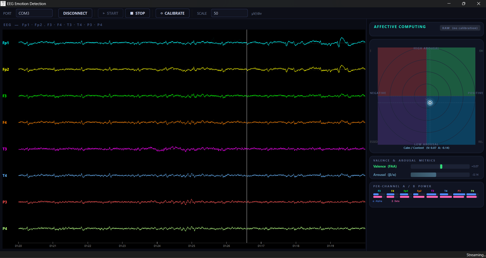

# Real-Time Affective Computing with OpenBCI 

A real-time EEG application that reads from an **OpenBCI Cyton** board and plots the user's emotional state on the **Russell Circumplex Model** — a 2-D affect grid with **Valence** (positive ↔ negative) on the X-axis and **Arousal** (high-energy ↔ low-energy) on the Y-axis.

Built with **C++17** and **Qt 6.5** on Windows.

---

## Table of Contents

- [Overview](#overview)
- [Screenshots](#screenshots)
- [Theory — Affective Computing](#theory--affective-computing)
  - [The Russell Circumplex Model](#the-russell-circumplex-model)
  - [Valence — Frontal Alpha Asymmetry (FAA)](#valence--frontal-alpha-asymmetry-faa)
  - [Arousal — Beta / Alpha Ratio](#arousal--beta--alpha-ratio)
  - [Normalisation](#normalisation)
- [Channel Mapping (10-20 System)](#channel-mapping-10-20-system)
- [Architecture](#architecture)
- [Signal Processing Pipeline](#signal-processing-pipeline)
- [Requirements](#requirements)
- [Building](#building)
- [Usage](#usage)
- [Project Structure](#project-structure)
- [License](#license)

---

## Overview

The application streams 8-channel EEG data at 250 Hz, runs each channel through a **1–40 Hz Butterworth bandpass filter**, estimates per-channel **Power Spectral Density** using **Welch's method** with a Hann window, and derives two affective metrics every 100 ms:

| Metric | Brain Signal | Channels Used |
|--------|-------------|---------------|
| **Valence** | Frontal Alpha Asymmetry (FAA) | Fp1, Fp2, F3, F4 |
| **Arousal** | Beta / Alpha power ratio | T3, T4, P3, P4 |

Both metrics are normalised against a 60-second personal baseline and plotted live on an animated Russell Circumplex.

---

## Screenshots



---

## Theory — Affective Computing

### The Russell Circumplex Model

James Russell's circumplex model (1980) organises emotions in a 2-D space defined by two independent, bipolar dimensions:

```
             HIGH AROUSAL
                  ▲
   Tense / Angry  │  Excited / Happy
                  │
 ─────────────────┼─────────────────▶
   NEGATIVE       │       POSITIVE
                  │
  Sad / Depressed │  Calm / Content
                  ▼
             LOW AROUSAL
```

Every emotional state maps to a coordinate `(Valence, Arousal)` ∈ `[−1, +1]²`. This application computes those coordinates from EEG in real time.

---

### Valence — Frontal Alpha Asymmetry (FAA)

Alpha waves (8–13 Hz) are **inhibitory** — more alpha in a region means less cortical activation there. The left frontal lobe is associated with **approach / positive** emotions; the right with **withdrawal / negative** emotions.

Frontal Alpha Asymmetry is therefore calculated as:

$$\text{Valence} = \ln\!\left(\frac{\alpha_{F4} + \alpha_{Fp2}}{2}\right) - \ln\!\left(\frac{\alpha_{F3} + \alpha_{Fp1}}{2}\right)$$

- **Positive value** → more right-side alpha (less right activation) → positive / approach emotional state
- **Negative value** → more left-side alpha (less left activation) → negative / withdrawal emotional state

---

### Arousal — Beta / Alpha Ratio

Arousal reflects overall cortical engagement. High beta (13–21 Hz) combined with low alpha indicates high mental activation. The metric is averaged across temporal and parietal sites:

$$\text{Arousal}_{\text{ch}} = \frac{\beta_{\text{ch}}}{\alpha_{\text{ch}}}$$

$$\text{Final Arousal} = \frac{\text{Arousal}_{T3} + \text{Arousal}_{T4} + \text{Arousal}_{P3} + \text{Arousal}_{P4}}{4}$$

---

### Normalisation

Raw FAA and β/α values vary substantially between individuals due to differences in skull thickness, electrode impedance, and baseline brain state. A **60-second calibration phase** (user sits calmly) records the personal min and max of each metric, which are then used to map subsequent values into `[−1, +1]`:

$$\text{Normalised} = \frac{X - X_{\min}}{X_{\max} - X_{\min}} \times 2 - 1$$

Before calibration, a soft-clamp is applied to make the display usable immediately.

---

## Channel Mapping (10-20 System)

The OpenBCI Cyton delivers 8 channels. The application uses the following electrode placement:

| Board Index | Electrode | Hemisphere | Role |
|:-----------:|-----------|-----------|------|
| 0 | **Fp1** | Left prefrontal | Valence — FAA left |
| 1 | **Fp2** | Right prefrontal | Valence — FAA right |
| 2 | **F3** | Left frontal | Valence — FAA left |
| 3 | **F4** | Right frontal | Valence — FAA right |
| 4 | **T3** | Left temporal | Arousal — β/α |
| 5 | **T4** | Right temporal | Arousal — β/α |
| 6 | **P3** | Left parietal | Arousal — β/α |
| 7 | **P4** | Right parietal | Arousal — β/α |

Reference and bias electrodes should be placed at **A1/A2** (earlobes) or **SRB2** per standard OpenBCI setup.

---

## Architecture

```
┌─────────────────────────────────────────────────────────────────┐
│                        Neurofeedback (QMainWindow)              │
│                                                                 │
│  ┌─────────────────────────────┐   ┌─────────────────────────┐  │
│  │        ScopeWidget          │   │      AffectivePanel     │  │
│  │  8-ch EEG oscilloscope      │   │  Russell Circumplex     │  │
│  │  Fp1 Fp2 F3 F4 T3 T4 P3 P4  │   │  Valence / Arousal bars │  │
│  │  Sweep-mode, 10 s window    │   │  Per-channel α/β table  │  │
│  └─────────────────────────────┘   └─────────────────────────┘  │
│                                                                 │
│  ┌──────────────────┐  ┌────────────┐  ┌─────────────────────┐  │
│  │  OpenBCIReader   │  │ Filtering  │  │      WelchPSD       │  │
│  │  Serial / 115200 │  │ 8th-order  │  │  Hann window 2 s    │  │
│  │  33-byte packets │  │ Butterworth│  │  Hop 100 ms         │  │
│  │  24-bit ADC      │  │ BP 1–40 Hz │  │  Radix-2 DIT FFT    │  │
│  └──────────────────┘  └────────────┘  └─────────────────────┘  │
└─────────────────────────────────────────────────────────────────┘

         Streaming thread                 Display timer (60 Hz)
   ┌─────────────────────────┐      ┌──────────────────────────┐
   │ readData() → processData│      │ Drain ring buffer        │
   │ Scale to µV             │      │ Compute α / β band power │
   │ BP filter               │      │ Update AffectivePanel    │
   │ Push to WelchPSD        │      └──────────────────────────┘
   │ Write to ring buffer    │
   └─────────────────────────┘
```

The hardware reader and DSP run in a **dedicated background thread**. Processed samples are pushed into a **lock-free power-of-2 ring buffer**. A **Qt display timer** at 60 Hz drains the ring buffer into the scope widget and queries the Welch estimators for band powers — keeping the GUI thread always responsive.

---

## Signal Processing Pipeline

```
Raw ADC sample (24-bit signed, big-endian)
        │
        ▼
× SCALE_UV  (4.5 V / 24× gain / 2²³ ≈ 0.02235 µV/LSB)
        │
        ▼
× 1 000 000  (scale to µV working range)
        │
        ▼
8th-order Butterworth bandpass  1 – 40 Hz
(fidlib, IIR biquad cascade, zero-phase dual-buffer)
        │
        ▼
Welch PSD  (window = 512 samples / 2.048 s,  hop = 25 samples / 100 ms)
Hann window  ·  Radix-2 DIT in-place FFT  ·  one-sided power/Hz
        │
        ├──▶  α band  8 – 13 Hz   →  bandPower()
        └──▶  β band 13 – 21 Hz   →  bandPower()
                    │
                    ▼
            FAA  +  β/α ratio
                    │
                    ▼
          Min-Max normalisation (baseline)
                    │
                    ▼
           (Valence, Arousal) ∈ [−1, +1]²
                    │
                    ▼
           Russell Circumplex plot
```

---

## Requirements

| Component | Version |
|-----------|---------|
| Windows | 10 / 11 (x64) |
| Visual Studio | 2022 (toolset v145) |
| Qt | 6.5 (core, gui, widgets, serialport) |
| Qt VS Tools | 3.x (`QtVS_v304`) |
| fidlib | 0.9.10 (included under `../libs/fidlib-0.9.10/`) |
| OpenBCI Cyton | any firmware ≥ 3.0 |

---

## Building

### 1. Clone the repository

```bash
git clone https://github.com/<your-username>/neurofeedback.git
cd neurofeedback
```

### 2. Place fidlib

The IIR filter design library must be present at:

```
../libs/fidlib-0.9.10/fidlib.c
../libs/fidlib-0.9.10/fidlib.h
```

Fidlib is available at http://uazu.net/fidlib/ and is compiled as a plain C file directly into the project.

### 3. Open in Visual Studio

Open `Neurofeedback.vcxproj` with **Visual Studio 2022**. The Qt VS Tools extension will pick up the `Qt 6.5` install automatically if it is registered in *Qt VS Tools → Qt Versions*.

### 4. Build

Select **Release | x64** (or Debug) and press **Build Solution** (`Ctrl+Shift+B`).

The output executable is placed in `x64/Release/Neurofeedback.exe`.

### 5. Deploy Qt DLLs

```cmd
cd x64\Release
windeployqt Neurofeedback.exe
```

---

## Usage

### Electrode placement

Place electrodes according to the 10-20 mapping table above. Ensure good scalp contact and low impedance (ideally < 10 kΩ per channel). Connect reference electrodes to earlobes (A1/A2).

### Running the application

1. **Connect the Cyton board** via USB–serial dongle (typically `COM3`–`COM9`).
2. Launch `Neurofeedback.exe`.
3. Select the correct **COM port** from the dropdown and click **CONNECT**.
4. Click **▶ START** to begin streaming. The EEG scope will start scrolling immediately.
5. **Calibrate** — click **⊙ CALIBRATE** and sit quietly with eyes open for 60 seconds. This records your personal alpha/beta baseline and enables accurate normalisation of the Valence and Arousal metrics.
6. After calibration the **Russell Circumplex** dot will move in real time reflecting your emotional state. The animated trail shows the last ~12 seconds of history.
7. Click **■ STOP** when finished.

### Toolbar reference

| Button | Function |
|--------|----------|
| PORT | Select the serial COM port for the Cyton dongle |
| CONNECT / DISCONNECT | Open or close the serial connection |
| ▶ START | Send `b` to the board and begin packet streaming |
| ■ STOP | Send `s` to the board and halt streaming |
| ⊙ CALIBRATE | Start / stop the 60-second baseline recording |
| SCALE | µV per division for the EEG scope (10 – 1000 µV) |

### AffectivePanel — display elements

| Element | Description |
|---------|-------------|
| **Russell Circumplex** | 2-D affect grid; animated dot = current state; fading trail = recent history; colour reflects quadrant |
| **Valence bar** | Bipolar bar: right = positive FAA, left = negative FAA |
| **Arousal bar** | Unipolar bar: right = high β/α, left = low β/α |
| **Per-channel table** | Stacked α (blue) / β (pink) mini-bars for all 8 electrodes |
| **Status pill** | Shows CALIBRATING countdown or CALIBRATED lock indicator |

---

## Project Structure

```
Neurofeedback/
├── main.cpp                 — Entry point, QApplication
├── Neurofeedback.h/.cpp     — Main window, toolbar, layout, display timer
├── AffectivePanel.h/.cpp    — Russell Circumplex Qt widget (all drawing)
├── ScopeWidget.h/.cpp       — 8-channel EEG oscilloscope widget
├── OpenBCIReader.h/.cpp     — Serial reader, packet decoder (Windows HANDLE API)
├── WelchPSD.h/.cpp          — Welch PSD estimator, Hann window, radix-2 FFT
├── Filtering.h/.cpp         — IIR bandpass / bandstop filter (wraps fidlib)
├── Neurofeedback.vcxproj    — Visual Studio 2022 project file (Qt 6.5, x64)
├── Neurofeedback.qrc        — Qt resource file (app icon)
└── Neurofeedback.ui         — Qt Designer UI stub
```

External dependency (not included — see [Building](#building)):
```
../libs/fidlib-0.9.10/
├── fidlib.c
└── fidlib.h
```

---

## License

This project is released under the **MIT License**. See `LICENSE` for details.

The **fidlib** library by Uwe Zimmer is distributed under the LGPL and is not included in this repository — see http://uazu.net/fidlib/ for its own license terms.

---

*Built on top of the [OpenBCI Cyton data format](https://docs.openbci.com/Cyton/CytonDataFormat/) and informed by Russell, J. A. (1980). A circumplex model of affect. Journal of Personality and Social Psychology, 39(6), 1161–1178.*